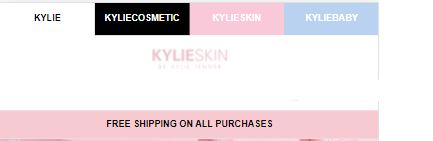

# Procesverslag
Markdown is een simpele manier om HTML te schrijven.  
Markdown cheat cheet: [Hulp bij het schrijven van Markdown](https://github.com/adam-p/markdown-here/wiki/Markdown-Cheatsheet).

Nb. De standaardstructuur en de spartaanse opmaak van de README.md zijn helemaal prima. Het gaat om de inhoud van je procesverslag. Besteedt de tijd voor pracht en praal aan je website.

Nb. Door *open* toe te voegen aan een *details* element kun je deze standaard open zetten. Fijn om dat steeds voor de relevante stuk(ken) te doen.

## Jij

uitwerken voor kick-off werkgroep

### Auteur:
Linsey Quatfass
#### Je startniveau:
Mijn start niveau is blauw

#### Je focus:
mijn focus ligt bij de surface plane.
 

## Je website

uitwerken voor kick-off werkgroep

### Je opdracht:
dit is de site die ik ga proberen na te maken.
https://kyliecosmetics.com/en-eu/kylie-skin

#### Screenshot(s) van de eerste pagina (small screen): 
hier de naam van de pagina  

#### Screenshot(s) van de tweede pagina (small screen):
hier de naam van de pagina  

 

## Breakdownschets (week 1)

uitwerken na afloop 2e werkgroep

### de hele pagina: 
ik heb hier een link naar de breakdown schetsen van de pagina's
https://miro.com/app/board/o9J_li9GZRs=/

### dynamisch deel (bijv menu): 
dynamisch deel is daar ook te vinden.

## Voortgang 1 (week 2)

uitwerken voor 1e voortgang

### Stand van zaken
Ik vondt het lastig om er weer een beetje in te komen. Coderen is niet mijn sterkste punt. Ik was vooral bezig met de oefeningen via codepen. Met coderen begon ik met de header dat al veel moeite voor mij kosten, omdat ik niet altijd 1,2,3 zie wat ik moet doen. Het kost altijd wat meer tijd bij mij.

### Agenda voor meeting
samen met je groepje opstellen

Linsey : Footer
Yeliz  : Geen vraag
Larissa: Knoppen centreren
Laurens: Animatie

### Verslag van meeting
hier na afloop snel de uitkomsten van de meeting vastleggen

- Aanpassen naar mobiele versie
- proberen nth toe te passen

## Voortgang 2 (week 3)

uitwerken voor 2e voortgang

### Stand van zaken
Mijn code houd ik nog niet echt netjes bij. Verder gaat het opzich wel goed en heb ik al veel nieuwe dingen geleerd dat ik wil gaan toe passen aan mijn website. Ik heb voor pagina 1 en 2 nu een beetje een opbouw van de pagina. De andere zijn wel veel verder dan mij, maar is besteed alsnog even veel tijd als hun eraan. 

De feedback punten van vorige week heb ik toegepast.

### Agenda voor meeting
samen met je groepje opstellen

Linsey  : Geen vraag
Yeliz   : Tweede pagina
Larissa : Dark mode
Anneke  : Geen vraag

### Verslag van meeting
hier na afloop snel de uitkomsten van de meeting vastleggen

- mijn css netjes maken
- verder had ik geen vragen tijdens de les en kreeg ook niet veel feedback daaromterug.

## Toegankelijkheidstest (week 4)

uitwerken na test in 8e voortgang

Bij deze les was ik er niet bij vanwege omstandigheden.

Daarom heb ik wel zelf nog de screnreader gedownload om toe te passen.

Ik had bij mijn images nog geen alt teksten, dat nam de screenreader ook niet over. Ik vondt screenreader wel wat lastig te begrijpen en heb toen ook hulp gevraagd aan mede studenten. Sommige teksten vergat de screenreader te lezen.

## Voortgang 3 (week 4)

uitwerken voor 3e voortgang

### Stand van zaken
Ik ben nog bezig met de pagina's helemaal vorm te geven, als ik dat helemaal heb gedaan ga ik bepaalde functies toevoegen waar aan het moet voldoen. Ik liep vast bij een youtube video dat ik om mijn website wilde plaatsen. Ik heb Zelf veel geprobeerd maar heb uiteindelijk toch een studentassistent om hulp gevraagd.

### Agenda voor meeting
samen met je groepje opstellen

Linsey   : Video
Yeliz    : DOM
Larissa  : Footer
Anneke   : CSS opschonen

### Verslag van meeting
hier na afloop snel de uitkomsten van de meeting vastleggen

- Ik was hier niet bij maar heb wel vragen via teams kunnen stellen aan de studentassistent. En dat was dus over de video en een vraag over een image als background.

## Eindgesprek (week 5)

uitwerken voor eindgesprek

### Stand van zaken
Ik had meer tijd nodig vanwege omstandigheden en omdat ik hier niet super goed in ben. Voor de herkansing heb ik een beter gevoel. De pagina's zijn nu helemaal vormgegeven en de functies zijn toegevoegd die moesten. 

de functies de ik heb uitgekozen om toe te voegen zijn:

- Zoekfunctie
- Contact Formulier
- Feedback (is te vinden bij het contact formulier, als je iets vergeet in te vullen krijg je een pop up)
- Video
- Lettertype vergroten 

Verder vondt ik het vak intressant, alleen om zelf te doen vindt ik nooit zo leuk... Zelf weet ik ook al goed wat ik wil gaan doen en dat is niet de tech kant op maar meer het vormgeven vooraf. 

### Screenshot(s)

## Bronnenlijst

continu bijhouden terwijl je werkt

Nb. Wees specifiek ('css-tricks' als bron is bijv. niet specifiek genoeg).

1. bron 1
2. bron 2
3. ...

